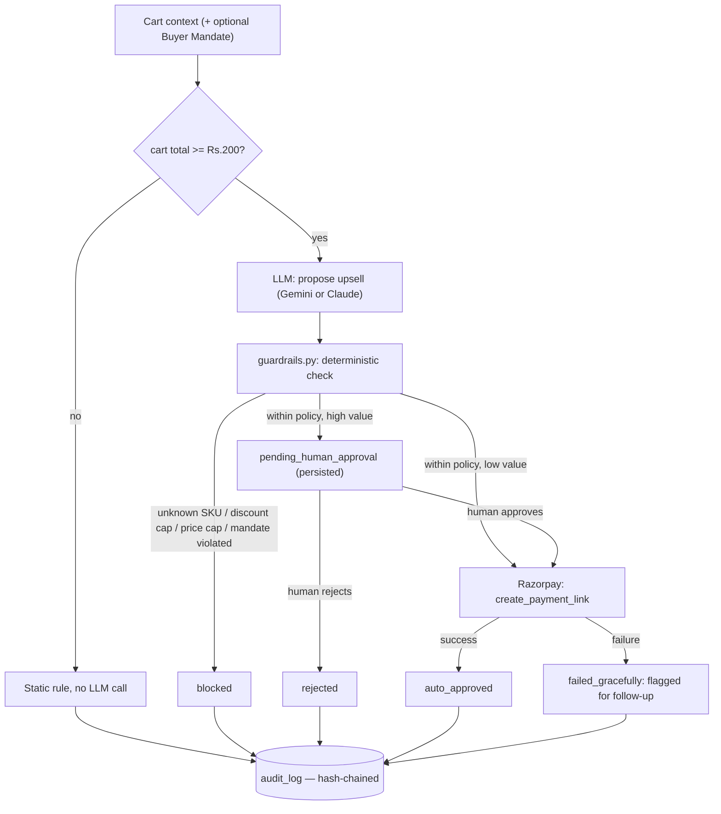
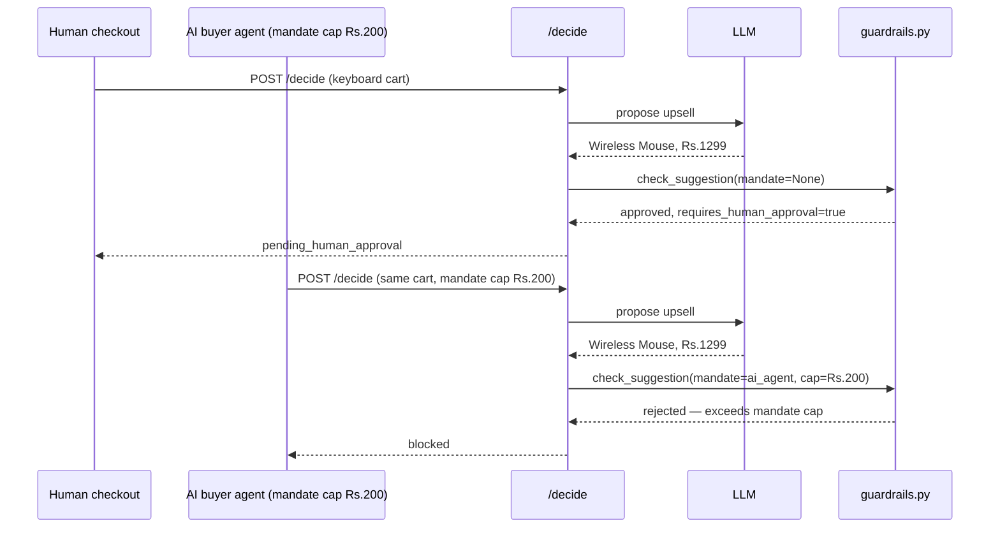

# AI Upsell Agent — Razorpay AI Buildathon, Track 01 (AI Growth & Agentic Commerce)

An upsell-decision service with two callers on the same trust boundary: a human checkout and an autonomous AI buyer agent. Both go through identical LLM reasoning, identical deterministic enforcement, and identical audit logging — but the AI-agent path carries a stricter auto-approval ceiling and an additional caller-declared spending mandate, because no human observes that transaction in real time.

Track bar, quoted directly from `razorpay.com/buildathon`: *"Every money action explainable, bounded and gated. Show the audit trail and one failure handled gracefully."* Every section below maps to a clause in that sentence.

## Judging-criteria map

| Criterion | Where |
|---|---|
| Problem Taste | Two callers, one enforcement boundary, differentiated risk posture — not a single-path upsell bot. `README §Mandate design`. |
| Build Quality | 30 automated tests (`tests/`), CI on every push (`.github/workflows/tests.yml`), curated dependency list, structured error handling with no unhandled 500s. |
| AI Judgment | LLM is the only non-deterministic component (`app/agent_gemini.py`), gated by static Python (`app/guardrails.py`) it cannot see or influence. Trivial-cart short-circuit (`should_call_agent()`) is an explicit skip-the-LLM rule, not a missing feature. |
| Failure Recovery | `POST /demo/simulate-failure` — real Razorpay 400 on an invalid payload, caught, logged, recovered without a 500. `app/razorpay_client.py` never raises to its caller. |

## Pipeline



The LLM output (`D`) is a proposal. `guardrails.py` is the only enforcement point, runs after every LLM call, and is plain Python — no prompt-level trust.

## Mandate design

An `ai_agent` caller declares `max_spend_paise` and `allowed_categories` up front. `guardrails.py` intersects that mandate with merchant policy and enforces the stricter of the two — never trusts the caller's self-report as sufficient on its own. Two independent auto-approval ceilings exist for this reason:

| Caller | Auto-approve ceiling | Rationale |
|---|---|---|
| Human customer | < ₹300 | above this, a person signs off before Razorpay fires |
| AI buyer agent | < ₹150 | stricter — nothing is watching the decision happen in real time |

Same LLM call, same cart, same suggested item, two different real outcomes depending solely on caller identity — reproduced against the live system, not synthesized for this document:



`buyer_agent.py` is a standalone process demonstrating the agent-to-agent claim concretely: it holds no imports from `app/`, speaks only HTTP, declares its own mandate, and reacts autonomously (accept the payment link / wait on human review / decline cleanly on a mandate breach) rather than being a JSON field asserted in a request body.

## Architecture
app/
├── main.py FastAPI orchestration: routing, auth, idempotency, metrics
├── agent_gemini.py LLM reasoning (Gemini). Only non-deterministic component in the system.
├── agent.py Same interface, Claude backend — LLM_BACKEND=claude in .env
├── guardrails.py Deterministic enforcement. Never sees the LLM's prompt or reasoning.
├── audit.py Hash-chained SQLite log + persisted pending-decision store
├── razorpay_client.py Razorpay Test Mode wrapper — structured failures, never raises
├── mock_data.py Demo merchant catalog + cart scenarios
└── models.py Pydantic schemas

buyer_agent.py Standalone autonomous AI buyer — separate process, HTTP-only
tests/ 30 pytest tests, mocked LLM/Razorpay, run in CI
live_checks/ Scripts that hit real Gemini/Claude/Razorpay — not in CI (need real keys)
.github/workflows/ CI: pytest on every push

## Safety & control

| Rule | Value | Enforced in |
|---|---|---|
| Max discount | 20% | `guardrails.py` |
| Max upsell price | ₹1,500 | `guardrails.py` |
| Human-approval threshold, human caller | ≥ ₹300 | `guardrails.py` |
| Human-approval threshold, AI-agent caller | ≥ ₹150 | `guardrails.py` |
| Buyer mandate cap / category scope | caller-declared | `guardrails.py`, intersected with merchant policy |
| Unknown SKU | rejected unconditionally | `guardrails.py` |
| Idempotent replay | same `Idempotency-Key` → cached result, zero re-execution | `main.py` |
| Shared-secret auth | `X-API-Key` on all mutating routes | `main.py` |

None of the above lives in a prompt. All of it runs after the LLM has already responded.

## Audit trail

`audit.py` writes an append-only SQLite log; every row's hash chains to the previous row in the same session. `verify_chain(session_id)` recomputes the chain and returns `valid=False` at the first altered or deleted row — proven directly in `tests/test_audit.py::test_tampering_is_detected`, which corrupts a row in place and asserts detection. `GET /audit/{session_id}` exposes the trail plus verification for any session; `GET /metrics` aggregates across all sessions for suggestion rate, approval rate, block rate, and realized revenue.

## Failure handling

`POST /demo/simulate-failure` sends Razorpay a negative amount. `razorpay_client.py` catches `BadRequestError` and returns a structured `{"ok": False, ...}` — never raises. `main.py` logs the failure and a `graceful_fallback` event, then returns `200` with `status: "failed_gracefully"`. No unhandled exception, no dropped intent. `tests/test_api.py::test_razorpay_failure_recovers_gracefully_not_500` asserts this against a mocked failure; `live_checks/test_razorpay_live.py` asserts it against Razorpay's real Test Mode API.

## Running it

```bash
python3 -m venv venv && source venv/bin/activate
pip install -r requirements.txt
cp .env.example .env   # RAZORPAY_KEY_ID, RAZORPAY_KEY_SECRET, GEMINI_API_KEY (or ANTHROPIC_API_KEY + LLM_BACKEND=claude)
uvicorn app.main:app --reload --port 8000
```

Interactive API docs: `localhost:8000/docs`. Standalone buyer-agent demo: `python3 buyer_agent.py`. Test suite: `pytest tests/ -v`.

## Known limitations, disclosed rather than hidden

- `IDEMPOTENCY_CACHE` is in-memory — a restart loses replay protection for in-flight retries (not approved transactions; those are persisted separately in `pending_decisions`).
- No per-day aggregate spend cap across auto-approved transactions — each is bounded individually, not cumulatively.
- Single hardcoded merchant catalog — no multi-tenant policy storage.
